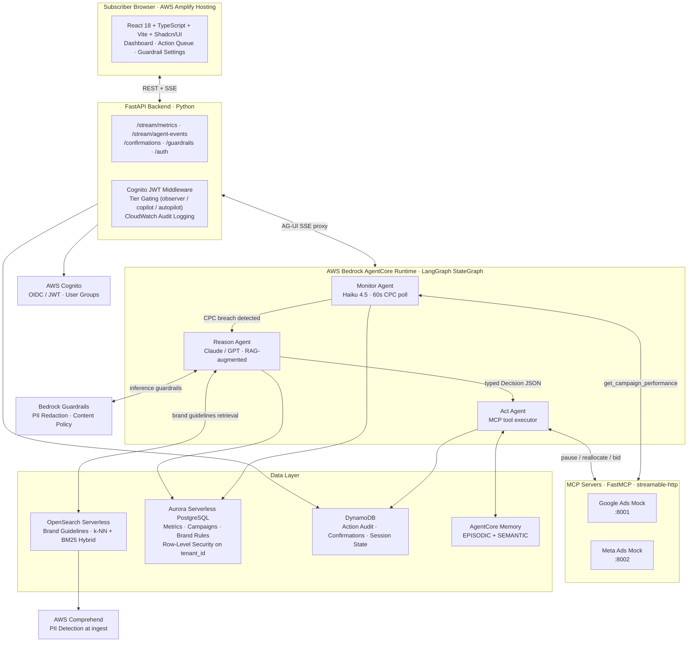

# Architecture Overview
## Agentic Campaign Orchestrator

**Phase:** architecture · **Iteration:** 1 · **Authored:** 2026-08-02  
**Inputs:** `decision-registry.yaml`, `discuss-prd.md`, `module-map.yaml`, `cloud-readiness.yaml`

> **Related Document:** [Product Requirements Document (PRD)](../discuss/discuss-prd.md) · `.aah/discuss/discuss-prd.md`

---

## 1. System Purpose

The Agentic Campaign Orchestrator is an autonomous SaaS platform that acts as a digital media buyer. It continuously monitors Google Ads and Meta campaign performance, detects CPC degradation, and autonomously takes corrective actions (pause ad sets, reallocate budget, update bid caps) within user-defined guardrails. Human oversight is enforced at configurable thresholds via a Co-Pilot approval workflow.

---

## 2. High-Level Component Map



---

## 3. Technology Stack

| Layer | Technology | Decision Rationale |
|---|---|---|
| **Agent Framework** | LangGraph `StateGraph` (TypedDict state) | Native AgentCore Runtime support; typed state prevents state corruption across nodes |
| **Agent Runtime** | AWS Bedrock AgentCore Runtime | Managed serverless; per-session microVM isolation; native MCP gateway; AG-UI SSE streaming |
| **LLM** | Provider-agnostic — Claude (Bedrock) / GPT (OpenAI API) | Avoid vendor lock-in; route via `LLM_PROVIDER` env var; Bedrock-hosted Claude default for SOC2/GDPR compliance |
| **Monitor LLM** | Cost-optimised fast model (Haiku 4.5 / GPT-3.5-turbo) | Polling is high-frequency; cheap model for compare-two-floats breach detection |
| **MCP Servers** | FastMCP (Python), HTTP/SSE transport | Lightweight; one server per ad network; native AgentCore MCP gateway integration |
| **Vector Store** | OpenSearch Serverless | BM25 + k-NN hybrid search; serverless scaling; index-per-tenant isolation |
| **Embeddings** | Amazon Titan Text Embeddings v2 (1536-dim) | Bedrock-native; no external API dependency; SOC2/GDPR compliant |
| **Relational Store** | Aurora Serverless PostgreSQL | SQL aggregation for CPC/CTR/ROAS time-series; RLS for multi-tenant isolation |
| **Session/Audit Store** | DynamoDB | Low-latency writes; partition key isolation; append-only audit table |
| **Agent Memory** | Bedrock AgentCore Memory (EPISODIC + SEMANTIC) | Cross-run campaign learning; managed by AgentCore (no separate infrastructure) |
| **Safety/PII** | Bedrock Guardrails + AWS Comprehend | Guardrails at LLM inference; Comprehend at RAG ingest boundary |
| **Backend API** | FastAPI (Python) | Async; SSE support; compatible with Pydantic v2 typed models |
| **Frontend** | React 18 + TypeScript + Vite + Shadcn/UI | Static SPA; AG-UI SSE EventSource; Shadcn/UI for dashboard components |
| **Frontend Hosting** | AWS Amplify Hosting | CDN; auto-HTTPS; static SPA zip-upload (no Amplify CLI required) |
| **Auth** | AWS Cognito (OIDC/JWT) | Managed; subscription tiers as User Groups; JWT claims for client tier UX |
| **Deployment** | Canary release | Gradual traffic shift; automatic rollback on error rate threshold |

---

## 4. Key Design Principles

### 4.1 Event-Triggered, Not Scheduled

The agent system is **reactive** — the Monitor agent runs continuously but the expensive reasoning+action loop only fires when a breach is detected. This minimises LLM token costs (cheap model for polling; full model only on breach) while maintaining near-real-time response (<5 minutes breach-to-action).

### 4.2 Provider-Agnostic LLM

The Reason agent uses a thin adapter pattern switchable via the `LLM_PROVIDER` environment variable. Claude on Bedrock is the default (SOC2/GDPR compliant; no data leaves AWS). Switching to OpenAI GPT requires no code change — only env var change.

### 4.3 Dual-Source RAG

Retrieval combines two complementary sources that answer different questions:
- **OpenSearch (semantic):** *"What do our brand guidelines say about ad creative?"*
- **Aurora (exact):** *"What has this ad set's CPC/CTR/ROAS been over the last 7 days?"*

Neither source alone is sufficient. The Reason agent receives both before deciding.

### 4.4 Safety-First Guardrail Stack

Guardrails operate at four independent layers:
1. **Business rules (deterministic):** spend-delta gate, campaign-pause approval rule, keyword protection
2. **Bedrock Guardrails (managed):** PII redaction, denied topics, content thresholds at LLM inference
3. **AWS Comprehend (managed):** PII detection at brand guidelines ingest (keeps PII out of RAG corpus)
4. **Human-in-the-loop:** DynamoDB confirmation queue for high-stakes actions; Co-Pilot approve/reject UI

### 4.5 Tenant Isolation at Every Layer

| Layer | Isolation Mechanism |
|---|---|
| PostgreSQL | Row-Level Security on `tenant_id` |
| DynamoDB | Partition key: `tenant_id#resource_id` |
| OpenSearch | Index-per-tenant: `tenant-{id}-brand-guidelines` |
| AgentCore | Per-session microVM; session carries `tenant_id` in state |
| API | Cognito JWT `tenant_id` claim; FastAPI extracts + enforces |

---

## 5. Subscription Tier Architecture

```
Cognito User Group   FastAPI Middleware      UI UX
─────────────────────────────────────────────────
observer            → read-only endpoints   → queue hidden; approve button disabled
copilot             → confirmations read/write → queue visible + approve/reject
autopilot           → full auto execution   → queue shows completed actions only
```

Tier gating is **hybrid**: JWT group claim used for client-side UX rendering (instant, no round-trip); FastAPI server enforces independently and logs every access decision to CloudWatch.

---

## 6. Data Flow Summary

```
[Ad Network Mock API]
        │
        │ MCP get_campaign_performance (60s poll)
        ▼
[Monitor Agent] → CPC baseline compare → breach? → NO → wait → repeat
        │
        YES (CPC > baseline × 1.20)
        │
        ▼
[Retrieve Context Node]
  ├─ OpenSearch: brand guidelines (semantic + BM25)
  ├─ Aurora: 7-day CPC/CTR/ROAS aggregates
  └─ AgentCore Memory: past interventions
        │
        ▼
[Reason Agent] → LLM (Claude/GPT) → typed Decision JSON
        │
        ▼
[Guardrail Check Node]
  ├─ spend_delta > $500? → requires_approval = True
  ├─ campaign pause? → requires_approval = True
  └─ brand keyword? → requires_approval = True
        │
   ┌────┴────┐
   │         │
auto      queued
   │         │
   ▼         ▼
[Act Node] [Enqueue to DynamoDB confirmation]
  MCP tool    Co-Pilot UI shows card → approve/reject
   │
   ▼
[Audit Write] → DynamoDB action-audit (immutable)
   │
   ▼
[Memory Write] → AgentCore EPISODIC memory (outcome stored)
```

---

## 7. Module-to-Component Mapping

| Module | Primary Components |
|---|---|
| MOD-000 | FastAPI scaffold, LangGraph StateGraph skeleton, Aurora migrations, DynamoDB tables, React scaffold, Amplify wiring |
| MOD-001 | Monitor agent node, FastMCP mock servers (Google Ads + Meta), Aurora metrics ingestion |
| MOD-002 | Retrieve context node, Reason agent node, OpenSearch RAG, AgentCore Memory integration |
| MOD-003 | Guardrail check node, Act agent node, MCP tool execution, DynamoDB audit+confirmation write |
| MOD-004 | React dashboard views, FastAPI SSE endpoints, AG-UI event proxy, Amplify hosting deploy |
| MOD-005 | Cognito group tier enforcement, RLS verification, GDPR erasure endpoint, Comprehend PII scan |

---

## 8. Provenance

| Section | Origin | Source |
|---|---|---|
| 1. System Purpose | Inherited | `discuss-prd.md §2`, `project-intent.yaml (raw_statement)` |
| 2. Component Map | Authored | Synthesised from `module-map.yaml`, `decision-registry.yaml → compute-platform`, `decision-registry.yaml → frontend-compute-platform`; ASCII diagram authored in arch phase |
| 3. Technology Stack | Inherited | `decision-registry.yaml` (all tech-choice slugs); rationale authored to expand on registry notes |
| 4.1 Event-Triggered Pattern | Inherited | `decision-registry.yaml → orchestration-pattern` |
| 4.2 Provider-Agnostic LLM | Inherited | `decision-registry.yaml → llm-choice` |
| 4.3 Dual-Source RAG | Inherited | `decision-registry.yaml → rag-data-model-strategy` |
| 4.4 Guardrail Stack | Inherited | `decision-registry.yaml → data-privacy-controls`, `decision-registry.yaml → campaign-pause-requires-approval`, `decision-registry.yaml → spend-delta-approval-threshold`, `decision-registry.yaml → brand-protection-strategy` |
| 4.5 Tenant Isolation | Inherited | `decision-registry.yaml → multi-tenant-isolation`, `decision-registry.yaml → gdpr-erasure-strategy` |
| 5. Subscription Tier Architecture | Inherited | `decision-registry.yaml → monetisation-model`, `decision-registry.yaml → tier-gating-pattern` |
| 6. Data Flow Summary | Authored | Synthesised from `agent-topology.md`, `discuss-prd.md §4` |
| 7. Module-to-Component Mapping | Inherited | `module-map.yaml (all modules)` |
